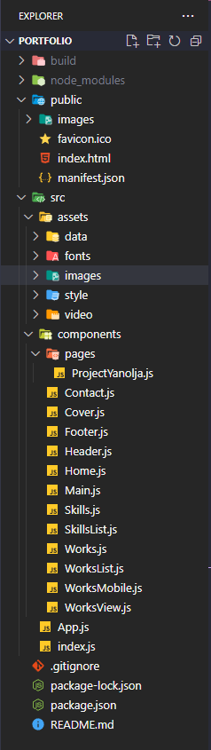

# 포트폴리오 프로젝트 일지

### 1. 이 프로젝트를 통해 얻고자 하는 게 무엇인가?

#### * 배운 것 최대한 활용하기

 약 6개월의 기간 동안 프론트엔드에 필요한 많은 것들을 배웠지만 직접 기획하고 디자인한 웹페이지를 만드는 건 처음인 만큼 그동안 배운 것을 최대한 활용하기

### * 오류와 타협하지 않기

 작업 과정에서 발생하는 오류와 타협하지 않고
**“ 무엇으로 어떻게 해결하는가? ”** 보다 **” 왜 해결이 되었는가? ”** 에 집중해서 문제 해결하기


## 2. 디렉토리 구조




## 3. 사용 기술


**used Skills :** React, SCSS, JavaScript

**used Tools :** GitHub, Visual Studio Code, Figma


## 4. 코딩 컨벤션

### 띄어쓰기

- 가독성을 위해 연산자, 주석, 괄호 중괄호 등 띄어쓰기 (Prettier 자동 정렬 참고)
        
```jsx
console.log('주석처리');//읽기어려움
console.log('읽기 편하게'); // 가독성 향상
console.log(x+y=z);
console.log(x + y = z);
```


### 네이밍 규칙

- 두 단어 이상 조합은 카멜 표기법 사용

```jsx
#txtBox / #slideBox / #scrollBox / #imgBox

.headerTitle .footerTitle .gnbTitle
```

- 변수 / 함수명은 동작이나 개념을 연상시키는 단어를 조합해서 작성.

```jsx
camelCase / headerTitle / getValue
```

- class, id 명은 요소의 성격을 나타내는 단어 활용.

```jsx
show / get / set / check / create … 등 참고
```

- 외부 파일명 (이미지, 비디오 등…)은 각 구역별로 미리 정리해서 사용 (파일 이름에는 _ 사용)

```jsx
article1_img01.png  /  footer_logo.svg  /  instagram_logo.jpg …
```

- 같은 변수, 아이디를 순차적으로 작성할 때는 1부터 시작되게 작성.

```jsx
box, box2, box3, box4

box1, box2, box3, box4
```


### 마크업 / css 규칙

- css / scss / styled-components 등 하나의 형식을 통일해서 사용
- 리셋 파일은 reset.css
- 폰트는 font.css 웹 폰트로 만들어서 사용
- 전역 스타일, @keyframes, css 변수는 문서 최상단에 작성
- 페이지 구조에 따라 순차적으로 마크업
position:fixed 요소 (top버튼, 메뉴 등)는 위치에 따라 최상단에 순차적으로 작성
- 외부 아이콘 사용 시 같은 출처 아이콘 통일해서 사용


### JS 규칙

- 괄호(), 중괄호{}, 세미콜론; 의 작성이나 띄어쓰기 규칙은 Prettier 스타일로 통일
- 수정 전 주석 처리한 함수는 삭제 정리.
- 변수는 한 줄에 하나씩 선언한다.

```jsx
let a = 1, b = 2;

let a = 1;
let b = 2;
```

- 디버깅을 위해 작성한 console.log()는 디버깅 후 꼭 삭제하기
- 함수 내에서 사용되는 변수는 되도록 지역 변수로 작성하며 사용되는 구문 앞에서 선언.
- 함수 내 구문이 한 줄이어도 줄 바꿈 후 작성

```jsx
const isOneLine = () => {	console.log("줄 바꿈") }

const isOneLine = () => {
console.log("줄 바꿈")
}
```

- 변수명, 함수명이 두 단어 이상의 조합이면 카멜표기법 사용. **(ex. useCamelCase)**
- 해당 문서 내에서 공통적으로 쓰이는 변수, 함수는 문서 상단에 선언 후 한 줄 띄우기.
- 함수는 실행 순서에 맞춰 작성하며 화살표 함수를 사용한다.
- 배열을 변수에 복사할 때는 전개 구문(스프레드 연산자) “…”을 사용하며 함수 내에서만 사용할 경우 지역 변수로 선언해서 사용.


### React 규칙

- 컴포넌트 파일명은 파스칼 표기법으로 작성한다 (ex. PascalCase.js)
- image 파일은 src 경로에 저장하며 변수로 import 후 사용.
- 함수형 컴포넌트로 작성하며 함수 선언문으로 통일한다.
- useState, useRef는 상단에 작성하며 한 줄 띄우기.
- useEffect에 사용되는 콜백 함수는 순차적으로 위에 작성하며 useEffect는 가장 아래에 작성.
- 부모 컴포넌트에서 전달받은 props는 가능하면 문서 최상단에서 구조 분해 할당 후 사용.


## 5. 페이지 구성

**All**

useMediaQuery를 이용한 PC / 모바일 반응형 웹페이지

---

**Header / Navigation**

- 상단 고정 내비게이션
- 타이틀 스와이프, box shadow 스크롤 이벤트
- 클릭 시 해당 컴포넌트로 스크롤 이동하는 onClick 이벤트
- 현재 위치한 컴포넌트를 나타내는 Nav 애니메이션

---

**Main**

- 스크롤에 따라 나타나는 컴포넌트 타이틀

- 반복되는 구조는 데이터 파일 import 후 map 메서드로 작성

- useRef + setTimeout + forEach를 이용한 메인 타이틀 비동기 이벤트 처리

---

**Work 세션**

- slice, spilt과 map을 조합해 배열 내 프로퍼티 출력 제어
- 삼항연산자와 useState를 사용해 조건에 맞는 컴포넌트만 출력
- useEffect + classList를 이용해 현재 선택된 리스트 구분
- router / Link를 이용해 프로젝트 상세 페이지 연결
- getBoundingClientRect() + classList를 이용한 특정 영역 마우스 이벤트


## 6. 문제 및 해결

<br/>


## **useEffect는 모든 렌더링이 끝나고 실행되는 게 아니었나?**

### 문제 발생

 **최초 렌더링 시 offsetTop 값이 이상하고 리렌더링 후에 제대로 된 값이 나타남**

---

내비게이션 버튼에 해당 페이지로 이동하는 onClick 이벤트를 주기 위해
각 컴포넌트의 offsetTop 값을 배열로 담는 함수를 사용했으나 값이 이상하게 출력 됨.


### 원인 파악

 **data.js 파일을 불러와 useState에 전달해서 사용한 것이 문제.**

---

최초 렌더링 시 문제이니 useEffect의 의존 배열을 지우면 문제는 해결되지만
의미 없는 이벤트 반복 호출이라는 다른 문제가 생기므로 직접적인 원인을 찾아야 했다.

Work의 offsetTop의 값이 이상해서 바로 위에 마운트 된 컴포넌트의 map을 사용한  콘텐츠 높이 값을 부모 컴포넌트의 함수가 인식하지 못한다는 걸 알아냈다.

**→ useEffect는 렌더링이 모두 끝난 후 실행되는 게 맞으며 자식에서 부모 순서로 작동.**

**→ 의존 배열이 빈 useEffect는 한 번만 실행하며 리렌더링 되어도 작동 X**

**→ 자식은 useEffect로 변경된 state를 map으로 리렌더링해서 브라우저에 출력하지만**

**→ 의존 배열이 비어있는 부모 useEffect는 최초 렌더링 시 잘못된 offsetTop 값 그대로.** 

</aside>

```jsx
// 자식 컴포넌트 Skills.js

import skillsData from "../assets/data/skillsData";

const [skills, setSkills] = useState([]);

useEffect(()=>{
    setData([...skillsData]);
  },[])
// state값이 변경되면서 아래 map도 리렌더링.

return (
    <article className="article_skills">
      <h3 className="headline">Skills</h3>
      {data.map((skills) => (
        <SkillsList key={skills.id} skills={skills} />
      ))}
    </article>
  );
}
```

```jsx
// 부모 컴포넌트 Home.js

const getTitle = useRef([]);

const getTitleLine = () => {
  getTitle.current = [0];

// 배열에 0을 먼저 담은 건 최상단 이동을 위해.

  const articles = mainRef.current.querySelectorAll(".headline");
  articles.forEach((art) => {
    getTitle.current = [...getTitle.current, art.offsetTop];
  });
};

useEffect(() => {
  getTitleLine();
  window.addEventListener("resize", getTitleLine);
  return () => {
    window.removeEventListener("resize", getTitleLine);
  };
}, []);

// 의존 배열이 비었기 때문에 최초 렌더링 시 잘못된 offsetTop값을 유지한다.
```

### 문제 해결


**부모 컴포넌트에서 useState를 쓰고 useEffect의 의존 배열에 [state] 작성 후**

**state는 자식 컴포넌트에게  props로 내려주는 방법도 있지만 코드가 길어져서 포기**

---


**useState 대신 useRef를 사용해서 해결**

**ref.current로 최초 렌더링 전에 data가 전달되고 그 후에 offsetTop을 읽는 useEffect 실행**


```jsx
import skillsData from "../assets/data/skillsData";

const data = useRef([]);
  data.current = [...skillsData];
```

---

<br/>

## scrollY는 대체 어디에 선언해야 제대로 작동하는가?

### 문제 발생


**useEffect로 작성한 스크롤 이벤트 리스너가 제대로 작동하지 않는다.**

---

### 원인 파악


**또 useEffect의 실행 순서를 몰랐던 게 문제였다.**

코드를 줄이려고 scrollY를 props로 전달했는데 useEffect는 자식 → 부모 순으로 실행.

props로 값을 받는 자식의 scrollY가 0에서 업데이트 되지 않는 문제.

값을 업데이트하기 위해 scrollY를 useEffect의 의존 배열로 넣으면 오히려 이벤트가 반복
렌더링 되면서 버벅거리는 현상이 발생.


```jsx
const [scrollY, setScrollY] = useState(0);
const headerRef = useRef(null);

const getScrollY = () => {
  setScrollY(window.scrollY);
}

useEffect(()=>{
	window.addEventListener("scroll", getScrollY);
return () => window.removeEventListener("scroll", getScrollY);
},[])

// ------------------부모 컴포넌트 -----------------//

// ------------------ ↓ props로 scrollY 전달 ↓ ----------------//

// ------------------자식 컴포넌트 -----------------//

useEffect(()=>{
	window.addEventListener("scroll", navControll)
return () => window.removeEventListener("scroll", navControll);
// navControll : 특정 스크롤을 넘기면 header에 class 부여.
}, [])
```

---

### 문제 해결


자식 컴포넌트 스크롤 이벤트는 useEffect로 의존 배열 없이 함수 실행만 작성해서 1차 해결

작동에는 문제가 없었지만 useEffect가 무분별하게 계속 실행되는 것도 좋지 않다고 생각.


```jsx
useEffect(()=>{
	navControll();
	moveToTitle();
})
// 의존 배열이 없으므로 매번 Effect 호출
```

---


**코드는 길어지지만 조금 더 안전하다고 생각해서 스크롤 이벤트 리스너의 콜백 함수들 내부에**

**scrollY = window.scrollY를 지역 변수로 선언해서 최종 해결했다.**


```jsx
const sideTitleUp = () => {const scrollY = window.scrollY; 함수 구문...}
const navControll = () => {const scrollY = window.scrollY; 함수 구문...}
const getTitleLine = () => {const scrollY = window.scrollY; 함수 구문...}
...

useEffect(()=>{
	window.addEventListener("scroll", navControll);
	window.addEventListener("scroll", sideTitleUp);
	window.addEventListener("scroll", getTitleLine);
	return () => {
		window.removeEventListener("scroll", navControll);
		window.removeEventListener("scroll", sideTitleUp);
		window.removeEventListener("scroll", getTitleLine);
}
},[])
```

---


<br/>

## offsetTop 값이 사라졌다?

### 문제 발생


 **작업 도중 제대로 작동하던 HTML요소의 offsetTop값이 갑자기 0을 반환한다.**

---

### 원인 파악


 **해당 요소의 부모 요소에 position이나 transform : translate()를 적용한 것이 원인.**

**해결은 했지만 정확한 원인은 아직 모르겠다.**

scss 스타일을 위해 부모 요소에 position:relative를 적용했는데 요소 자신을 기준으로 움직이는 속성이라 위치의 offset 값이 0이 되어서 그런 것이 아닌가 추측해봤다.

---

### 문제 해결


**프로젝트의 규모가 크지 않고 position을 쓰지 않고도 스타일 제어가 가능했기 때문에 일단 해결할 수 있었다.**


```jsx
만약 프로젝트의 규모가 크거나 position을 꼭 써야 하는 상황이라면 해당 요소의 절대 좌표를 구하는 방법으로
offsetTop 대신 getBoundingClientRect()을 사용하는 것으로 해결할 수 있다.
```

```jsx
const getTitleLine = () => {
    getTitle.current = [0];
    const articles = mainRef.current.querySelectorAll(".headline");
    articles.forEach((art) => {

      getTitle.current = [...getTitle.current, art.offsetTop];
//              [...getTitle.current, Math.trunc(art.getBoundingClientRect().top];
    });
  };
```

---


<br/>

# [💻포트폴리오 프로젝트 보러가기](http://frdytheme.github.io/Portfolio)

[GunhoKim Portfolio](https://frdytheme.github.io/Portfolio/)
